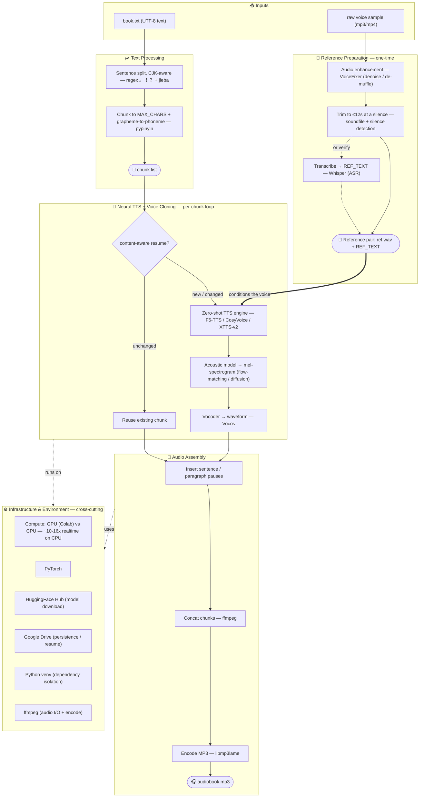

# Architecture — Voice-Cloned Audiobook Pipeline

End-to-end technique map for turning a **text file** into an **audiobook narrated in a cloned voice**
using free/open-source TTS. Two one-time inputs (the book text and a raw voice sample) flow through
reference prep, text chunking, neural synthesis, and audio assembly. A cross-cutting infrastructure
layer (compute, model hub, dependency isolation) underpins everything.

## Pipeline

## Stage → technique → tools

| Stage | Core technique | Tools used here |
|-------|----------------|-----------------|
| Reference prep | Audio DSP: enhancement, silence trim, resample | VoiceFixer, soundfile, pydub, librosa |
| Transcription | ASR (get/verify REF_TEXT) | Whisper |
| Text processing | NLP: CJK sentence segmentation, chunking, G2P | regex, jieba, pypinyin |
| Synthesis | Neural TTS + **zero-shot voice cloning** | F5-TTS, CosyVoice, XTTS-v2 |
| Waveform gen | Vocoder (mel-spectrogram → audio) | Vocos |
| Assembly | Audio concat, pausing, encoding | ffmpeg (libmp3lame), numpy |
| Orchestration | chunk→generate→stitch, content-aware resume | project scripts / notebooks |
| Infrastructure | GPU compute, model hosting, env isolation | Colab, PyTorch, HuggingFace Hub, Drive, venv |

## Concepts that actually bite you

- **Reference pair must match** — the reference audio and REF_TEXT must be the same words, or cloning
  quality silently degrades. (Engines cap the reference: F5 clips to **12s**.)
- **Zero-shot uses a *short* reference** (≤12–15s). "More audio = better" applies only to **fine-tuning**.
- **Realtime factor** decides feasibility: neural TTS on CPU is ~10–16× realtime → a full book needs a **GPU**.
- **Model input limits** — chunk generation text (~200 chars/chunk) and trim the reference clip.

## Engine choice (Chinese quality, observed)

CosyVoice 3 ≥ F5-TTS > XTTS-v2 — all **zero-shot**. For a bigger jump, **fine-tune** (e.g. GPT-SoVITS).
Production path in this repo: **CosyVoice on Colab GPU** (best quality + practical speed).
